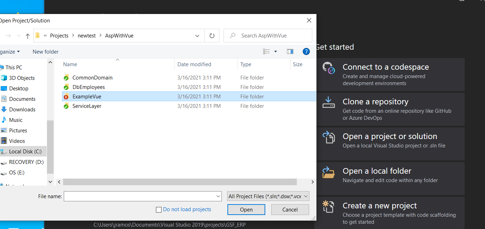
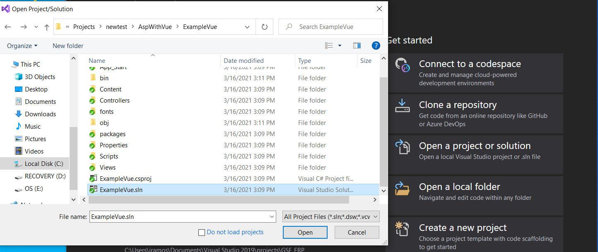
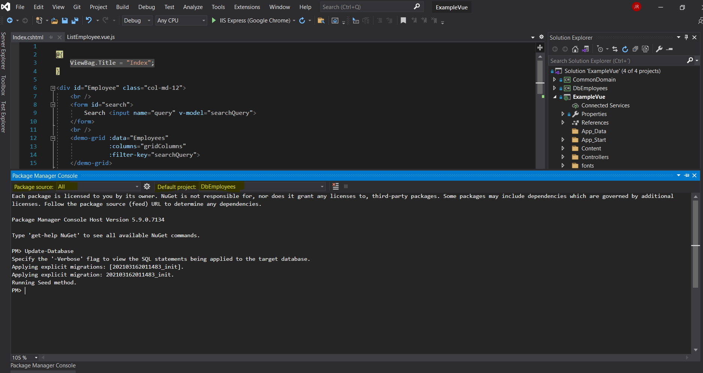

# Requisitos
 * visual studio 2019
 * net framework 4.7
 * sql Manager


## Abrir Solucion, desde el proyecto ExampleVue


## Seleccionar ExampleVue.sln


## Restaurar base de datos FirstCode
desde la consola de nuget( esta se encuentra en Tools->Nuget package Manager -> Nuget package Manager Console )
se debe ejecutar el siguiente comando

```bash
Update-Database
```




luego de esto se puede ejecutar la aplicacion dando al boton de run

en caso de configurar contraseña de base de datos esto lo pueden hacer desde el archivo web.config del proyecto ExampleVue
